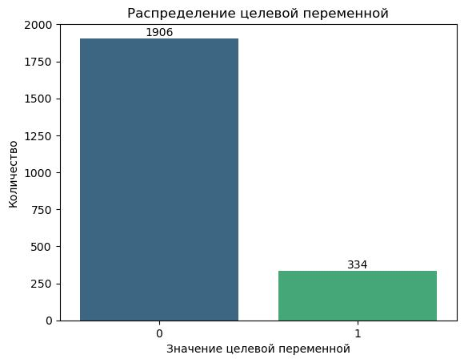
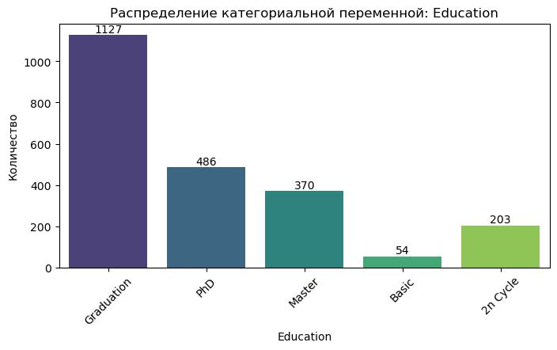
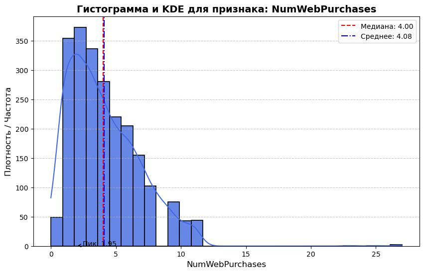
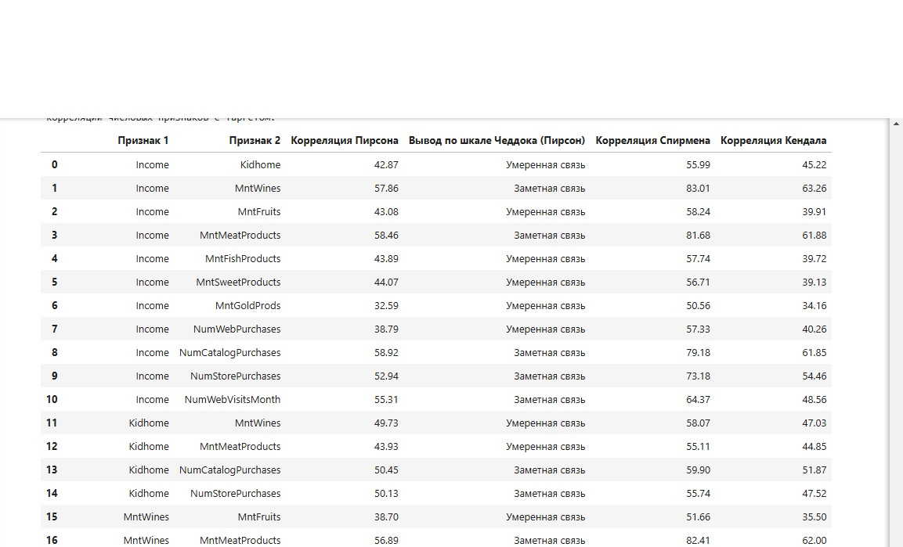
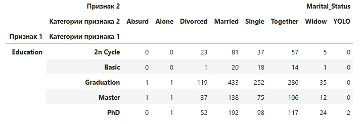
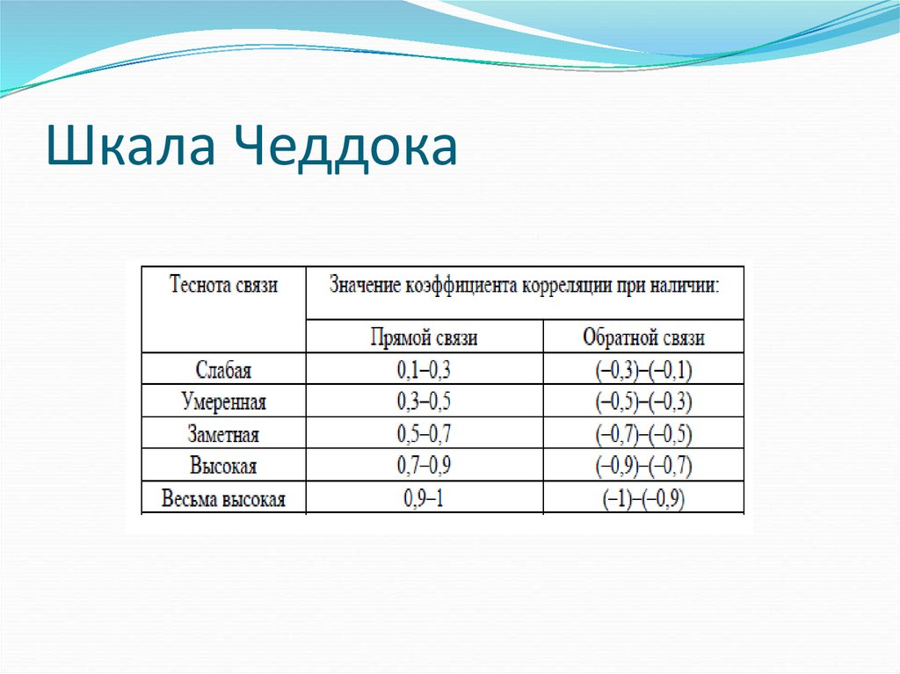
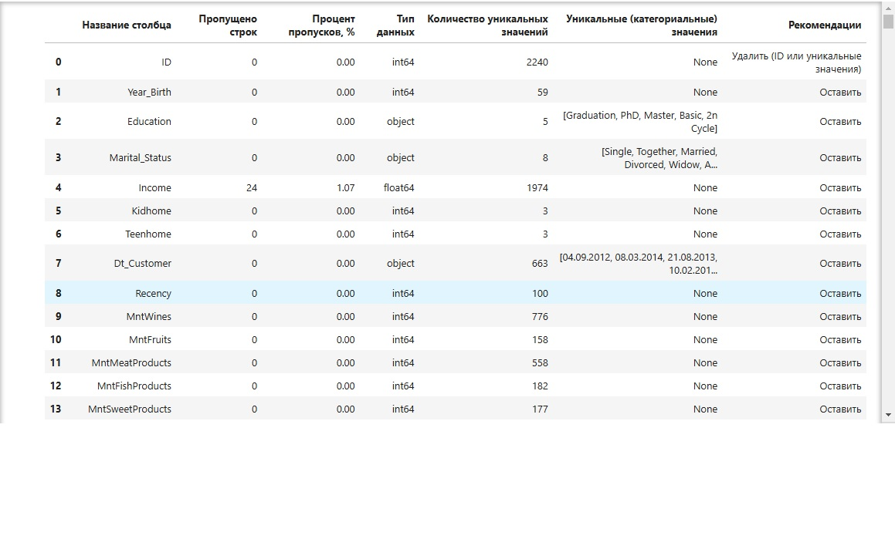
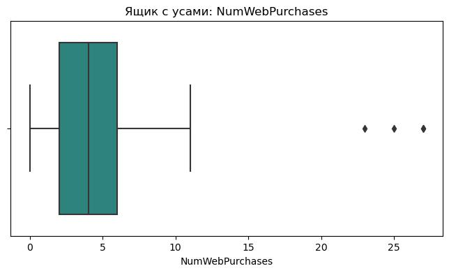
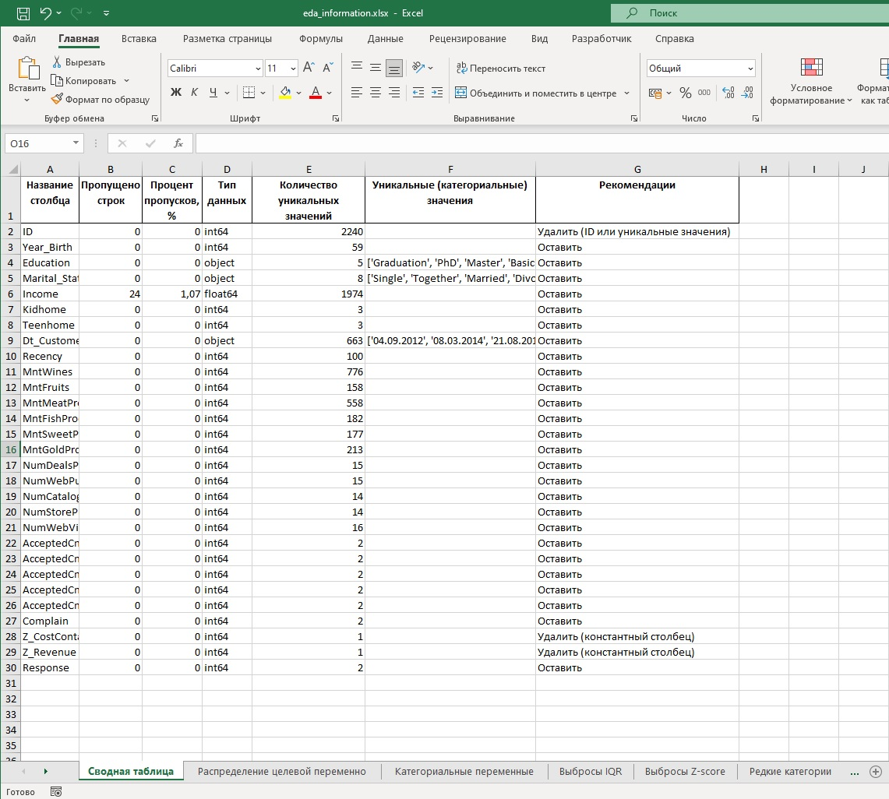

# Exploratory Data Analysis (EDA)

# README

## Описание

`EDAProcessor` — это класс для выполнения разведочного анализа данных (Exploratory Data Analysis, EDA). 
Он предназначен для анализа, визуализации и предварительной обработки данных, а также для генерации сводных таблиц и отчетов. 
Основные возможности включают анализ выбросов, визуализацию распределений, анализ корреляций и создание таблиц сопряженности.

---

## Основные возможности

1. **Генерация EDA-резюме**:
   - 🔍 Анализ столбцов (пропущенные значения, типы данных, уникальные значения).
   - 🔍 Поиск дубликатов строк и столбцов.
   - 🔍 Рекомендации по обработке столбцов.

2. **Визуализация распределений**:
   - 🔍 Распределение целевой переменной (бинарной).
   
   - 🔍 Распределения категориальных переменных.
   
   - 🔍 Распределения числовых переменных с использованием KDE и гистограмм.

   **KDE (Kernel Density Estimation)** — это метод оценки плотности распределения данных, который позволяет визуально понять форму распределения числовой переменной. 
   На графиках распределений, включая KDE, отображаются такие метрики, как среднее, медиана, и пики плотности. 
   Эти данные помогают выявить симметрию или смещение распределения, наличие выбросов и определить тип распределения (нормальное, смещенное и т.д.).

   

4. **Анализ выбросов**:
   - 🔍 Выявление выбросов на основе IQR (межквартильного размаха).
   - 🔍 Выявление выбросов на основе Z-оценки.

   **Анализ выбросов** помогает определить значения, которые существенно отклоняются от основной массы данных, так как они могут негативно влиять на результаты модели.

   - 👉 **IQR (Interquartile Range)**: Метод, основанный на межквартильном размахе. 
     Выбросы — это значения, выходящие за пределы диапазона `[Q1 - 1.5 * IQR, Q3 + 1.5 * IQR]`, где `Q1` и `Q3` — 25-й и 75-й процентили. 
     Это эффективный способ для обнаружения выбросов в данных с асимметричным распределением.
   - 👉 **Z-score**: Статистический метод, измеряющий, насколько значение отклоняется от среднего в стандартных отклонениях. 
     Выбросы определяются как значения с Z-score выше заданного порога (обычно 3). 
     Этот метод хорошо работает с данными, имеющими нормальное распределение.

   **Разница**: IQR применяется для оценки выбросов на основе абсолютных значений, тогда как Z-score учитывает относительное отклонение от среднего.

5. **Анализ корреляций**:
   - 🔍 Корреляции между числовыми признаками.
   - 🔍 ANOVA-тест для числовых признаков и категориальной целевой переменной.
   - 🔍 Cramer's V для категориальных признаков.
   

   **Корреляционный анализ** позволяет понять взаимосвязи между переменными.  
   - 👉 **ANOVA (Analysis of Variance)** используется для анализа различий между группами, чтобы понять, влияет ли категория целевой переменной на значения числового признака.
   - 👉 **Cramer's V** применяется для определения силы взаимосвязи между двумя категориальными признаками. 
     Значения `V` варьируются от 0 (нет связи) до 1 (идеальная связь).

6. **Работа с категориальными переменными**:
   - 📊 Таблицы сопряженности: используются для изучения взаимосвязей между категориальными переменными. 
     Они позволяют выявить зависимости и проверить гипотезы о связях между категориями.
     
   - 📊 Анализ редких категорий: помогает обнаружить значения, которые встречаются крайне редко. 
     Такие категории могут быть объединены с другими или обработаны отдельно для улучшения работы модели.

7. **Использование нескольких методов корреляции**:
   Для анализа корреляций используются три метода: Пирсона, Спирмена и Кендалла.  
   - 🔍 **Пирсон** оценивает линейную зависимость между переменными.
   - 🔍 **Спирмен** измеряет ранговую корреляцию, подходящую для нелинейных связей.
   - 🔍 **Кендалл** оценивает согласованность рангов.  

   **Шкала Чеддока** используется только для коэффициента Пирсона, так как она предназначена для интерпретации линейной зависимости.  
    .

8. 📂 **Сохранение отчетов**: Все сводные таблицы сохраняются в одном Excel-файле, а графики — в директории `DATA_OUT/graphics`.

---

## Примеры использования

### Генерация EDA-резюме
```python
eda_summary = eda.generate_eda_summary()
print(eda_summary['summary'])
```


### Визуализация распределения целевой переменной
```python
eda.plot_target_distribution(target_column="target")
```


### Анализ выбросов
```python
outliers = eda.detect_outliers_iqr(numeric_columns=["column1", "column2"])
print(outliers)
```

### Анализ корреляций
```python
correlations = eda.analyze_correlations(target_column="target", threshold=0.5)
print(correlations['correlations'])
```

### Сохранение отчетов в Excel
```python
summaries = {
    "EDA Summary": eda_summary['summary'],
    "Outliers": outliers
}
eda.save_all_summaries_to_excel(summaries)
```

